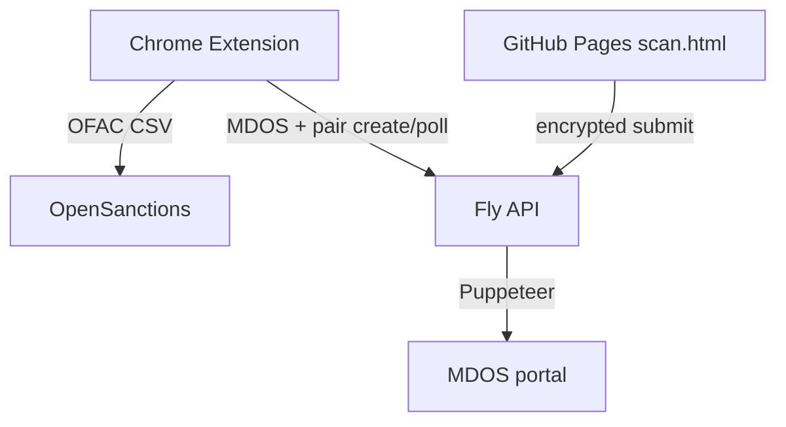

# Production Readiness Plan — Compliance Central 1.3.0

## Verdict

Prior July 17 fixes are solid (**81/81 tests**, lint clean, narrow MV3 permissions, OFAC fail-safe, E2E pairing crypto). **Not ready to upload yet.** One ship-blocking correctness bug remains in phone scan, plus disclosure/ops gates before store submission.

Reviews synthesized from: Prod readiness extension, Prod connections security, Backend and ops readiness.

Backend lives in sibling repo `compliance-central-api` (not this repo). Live `/health` and Pages URLs are up.

---

## Ship blockers (must fix / confirm)

1. **Phone-scan drops `isMichigan`** — `src/sidepanel/scan-pairing.js` `sanitizeScanPayload` rebuilds buyer/coBuyer without the boolean from `docs/scan.js`. Jurisdiction becomes `null` → assumed Michigan → out-of-state IDs can incorrectly run Repeat Offender.
   - Fix: preserve `isMichigan` (boolean only) through sanitize → `applyCustomerData` / `recordScanJurisdiction`.
   - Add unit test in `tests/review-fixes.test.js`.

2. **Repackage before upload** — Always `npm run package` from the final committed tree. Do not upload a stale `compliance-central-1.3.0.zip`.

3. **Fly pairing + multi-machine** — In-memory relay in `compliance-central-api` assumes same machine; `fly.toml` allows `max_machines_running = 4`. Confirm production is single-machine, or set max to 1 / add sticky sessions / shared store.

4. **Verify Fly `ALLOWED_EXTENSION_ID`** — Ensure production CORS is pinned to the published extension ID, not `"*"`.

---

## Before ship (high priority)

5. **Clear vs late `complete` race** — Soft cancel can still lose a race if the worker writes `complete` after Clear. Add a sidepanel generation/token so storage `complete` is ignored after Clear/cancel.

6. **Cancel mid-MDOS residue** — `src/worker/mdos-check.js` can still write badge + legacy `searchHistory` after cancel. Skip side effects when abort is requested (or clear them on cancel).

7. **Store / privacy disclosure accuracy**
   - Update `store-assets/chrome-web-store/privacy-tab.txt` and `listing.md`: history no longer stores evidence screenshots (OFAC DB + text history justify `unlimitedStorage`).
   - Align paste sources: `description.txt` mentions phone scan; listing detailed description may omit it — one consistent story.
   - Optionally note 30-day / 50-entry retention and that DOB/DLN text still stays in local history.

8. **Clear All History gap** — Also remove legacy `searchHistory` (or stop writing it) so Clear All matches privacy claims.

9. **Commit / tag 1.3.0** — Working tree holds the ship candidate; commit before packaging so the zip is reproducible.

---

## Nice-to-have (can ship without)

- Scan page CSP / branding banner on GitHub Pages; remove stale Phase-1 comments in `docs/scan.js`
- Wire or remove unused `isBackendAvailable()` preflight
- CI: add `npm run lint` (+ optional package / `/health` smoke)
- Root README pointing at DEVELOPMENT.md + Pages privacy
- API README / `GET /` document pairing + `CC_API_KEY`
- Soft rate limit on `POST /pair/new`; consider removing unused public `/api/ofac/*` routes under the shared key
- Stuck-run UX if SW dies (5‑minute stuck path exists; could be clearer)

---

## Explicitly deferred (post-launch)

- Rotate shipped `defaultApiKey` / install-bound auth (backend + extension release)
- Encrypt history PII at rest
- SDN content checksum / real publishDate
- PDF visual-regression / sidepanel e2e
- Large `export.js` / `results.js` splits (DEVELOPMENT.md)

---

## Recommended execution order

| Step | Work | Repo |
|------|------|------|
| 1 | Preserve `isMichigan` + test | extension |
| 2 | Clear generation guard + cancel side-effect cleanup | extension |
| 3 | Store privacy / description alignment; Clear All clears `searchHistory` | extension |
| 4 | Confirm Fly machine count + `ALLOWED_EXTENSION_ID` | API / Fly secrets |
| 5 | Commit, `npm run package`, upload that zip + update store privacy fields | extension + CWS |

---

## Definition of done for “production ready”

- Out-of-state phone scan skips Michigan RO (tested)
- Clear cannot resurrect results from a cancelled run
- Store privacy text matches behavior (no long-term screenshot claim)
- Fly pairing reliable under current machine count; CORS pinned
- Fresh zip from committed 1.3.0 source; 81+ tests green
