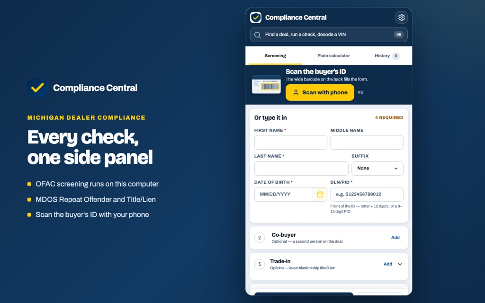

# Compliance Central

**Michigan dealer compliance, in one Chrome side panel.**

Running a deal in Michigan means checking the same buyer in three different places: the
U.S. Treasury OFAC sanctions list, the Michigan Department of State's Repeat Offender
record, and the title and lien status of the trade. Three sites, three searches, three
sets of paperwork — while a customer waits at the desk.

Compliance Central runs all three from a side panel that sits beside the CRM you already
have open, then prints or exports the record for the deal jacket.



---

## What it checks

| Check | Source | Runs |
| --- | --- | --- |
| **OFAC sanctions screening** | U.S. Treasury SDN list | Entirely on your computer — the list is downloaded and searched locally, so no customer name is transmitted for this check |
| **Repeat Offender** | Michigan MDOS online services | Over HTTPS through the project's backend, which drives the state's own site |
| **Title & Lien** | Michigan MDOS online services | Same, using the trade-in VIN |
| **Plate fee** | Michigan SOS fee calculator | The state's own calculator, so the number is the state's, not an estimate of ours |

Each run captures the state's own page as evidence and produces a printable record with
your dealership's name and logo on it.

## Other things it does

- **Scan the buyer's ID with a phone.** A QR code pairs your phone to the panel over an
  encrypted channel; you scan the PDF417 barcode on the back of the licence and the buyer
  fields fill in. The images stay on the phone — only the decoded text is sent.
- **Keeps thirty days of records** on the device, so a deal can be reopened, re-screened
  or reprinted, and exports an audit CSV.
- **Reminds you to re-screen** a deal that has aged before delivery.

## Install

**Published build —** [Chrome Web Store](https://chromewebstore.google.com/detail/compliance-central-michig/oijkbdclicekpggjblgknnphfdafdgod)

**Test build —** download the latest packaged zip:

**https://github.com/TechSavvyJoe/compliance-central/releases/latest** — download the
`compliance-central-<version>.zip` attached to the newest release.

Extract it, then in Chrome go to `chrome://extensions`, turn on **Developer mode**, choose
**Load unpacked**, and select the folder that has `manifest.json` sitting directly inside
it. (If you only see another folder, go one level deeper.)

**From source —** clone the repo and load the checkout itself; `manifest.json` is at the
root, so the repo folder loads unpacked as-is.

```bash
git clone https://github.com/TechSavvyJoe/compliance-central.git
```

## Repository layout

| Path | What lives there |
| --- | --- |
| `manifest.json`, `service-worker.js`, `sidepanel.*` | The extension itself |
| `src/sidepanel/` | Panel modules — checks, results, history, reports, export |
| `src/worker/` | Background orchestration and the individual check runners |
| `lib/` | Shared config, storage keys, retention rules, vendored jsPDF/QR |
| `ofac/` | On-device SDN storage and name search |
| `docs/` | The public site and the phone scanner page, served by GitHub Pages |
| `tests/` | Node test suites (`npm test`) |
| `tools/` | Packaging, package verification, store-asset capture |
| `store-assets/` | Chrome Web Store listing copy and imagery |
| `specs/`, `findings/` | Design documents and a written-up security finding |

The backend that drives the MDOS and SOS sites lives in a separate repository,
`compliance-central-api`.

## Development

```bash
npm install
npm test            # 351 tests
npm run lint
npm run package     # build the Web Store zip
```

See [DEVELOPMENT.md](DEVELOPMENT.md) for the details, including which scripts need
extra dependencies.

Pushing a `v*` tag runs the same checks and publishes a downloadable build:

```bash
git tag v1.6.1 && git push origin v1.6.1
```

## Privacy

The full policy is at
[techsavvyjoe.github.io/compliance-central](https://techsavvyjoe.github.io/compliance-central/).
In short: the OFAC search itself runs against a list stored on your machine, so an
OFAC-only check transmits nothing; the MDOS and SOS checks do send the fields the state's
own forms ask for, over HTTPS; saved records stay on the machine for up to thirty days;
and nothing is sold, shared or used for advertising. Read the policy for the specifics —
this paragraph is a summary, not the terms.

## What this is not

Compliance Central is a tool that runs searches and records what they returned. It is not
an OFAC determination, not legal advice, and not a certification that a deal is compliant.
A no-match result does not by itself establish that a party is legally cleared, and
potential matches require human review. It is not issued or endorsed by the U.S. Treasury,
OFAC, the State of Michigan, or the Michigan Secretary of State.

## License

No licence has been chosen, so default copyright applies: all rights reserved by the
author. The source is public to be read and reviewed, not re-used.
